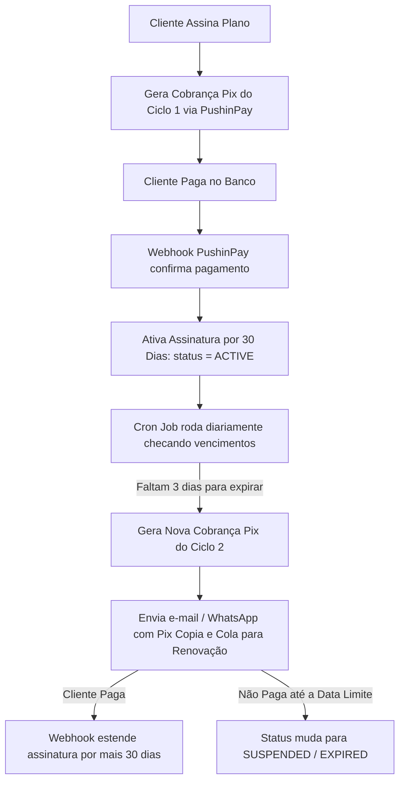

# Guia Completo de Integração PushinPay (Pix, Webhook e Assinaturas)

Este documento é um manual técnico e prático passo a passo de como integrar e operar a gateway de pagamentos **PushinPay** para cobranças Pix avulsas, notificações via Webhook em tempo real, saques (Cash-Out) e modelos de pagamentos por assinatura/recorrência.

---

## 📌 Sumário
1. [Visão Geral e Links Oficiais](#1-visão-geral-e-links-oficiais)
2. [Ambiente, Credenciais e Autenticação](#2-ambiente-credenciais-e-autenticação)
3. [Pagamento Avulso (Cash-In) & Geração de QR Code Pix](#3-pagamento-avulso-cash-in--geração-de-qr-code-pix)
4. [Consulta Manual de Transação (Polling / Fallback)](#4-consulta-manual-de-transação-polling--fallback)
5. [Webhook em Tempo Real & Blindagem contra Timeout](#5-webhook-em-tempo-real--blindagem-contra-timeout)
6. [Pagamentos por Assinatura e Recorrência com Pix](#6-pagamentos-por-assinatura-e-recorrência-com-pix)
7. [Transferências e Saques Pix (Cash-Out)](#7-transferências-e-saques-pix-cash-out)
8. [Boas Práticas de Segurança e Checklist de Produção](#8-boas-práticas-de-segurança-e-checklist-de-produção)

---

## 1. Visão Geral e Links Oficiais

A **PushinPay** é uma instituição de pagamentos focada em liquidação Pix instantânea, oferecendo taxas competitivas, baixa latência e webhooks automatizados.

### Links e Recursos Oficiais:
- **Site Oficial:** [https://pushinpay.com.br](https://pushinpay.com.br)
- **Painel do Cliente / Dashboard:** [https://app.pushinpay.com.br](https://app.pushinpay.com.br)
- **Base URL da API (Produção):** `https://api.pushinpay.com.br/api`
- **Documentação de Endpoints (Swagger / Postman):** Disponível através do painel da PushinPay na aba **Integrações / API**.

---

## 2. Ambiente, Credenciais e Autenticação

Para realizar requisições na API da PushinPay, todas as chamadas HTTP devem conter o token de autenticação via cabeçalho `Authorization: Bearer <SEU_TOKEN>`.

### Como obter suas credenciais:
1. Acesse o painel da PushinPay em [app.pushinpay.com.br](https://app.pushinpay.com.br).
2. Vá em **Configurações** ou **Tokens de Acesso** / **Integração**.
3. Crie um novo Token de API com permissão de leitura e escrita.
4. Defina um **Token Secreto para Webhook** (uma string aleatória e segura, ex: gerada com UUID v4 ou chave criptográfica).

### Configuração no `.env` (Variáveis de Ambiente):
```env
# Token da API PushinPay (Bearer Token)
PUSHINPAY_TOKEN="1234|abcde1234567890fghij..."

# Token de Segurança Privado para Validar Requisições do Webhook
PUSHINPAY_WEBHOOK_TOKEN="meu_token_secreto_super_seguro_webhook_2026"

# URL base da sua aplicação (deve ser HTTPS público)
NEXT_PUBLIC_APP_URL="https://seudominio.com.br"
```

> **Atenção:** Em ambiente local (`localhost`), para testar o Webhook é obrigatório utilizar um túnel HTTPS como **ngrok**, **Cloudflare Tunnels** ou **Localtunnel**, pois a PushinPay só envia requisições para URLs com HTTPS válido.

---

## 3. Pagamento Avulso (Cash-In) & Geração de QR Code Pix

Para gerar uma cobrança Pix com QR Code dinâmico e código "Copia e Cola", acione o endpoint `POST /api/pix/cashIn`.

### Endpoint:
```http
POST https://api.pushinpay.com.br/api/pix/cashIn
```

### Cabeçalhos (Headers):
```http
Authorization: Bearer <PUSHINPAY_TOKEN>
Accept: application/json
Content-Type: application/json
```

### Corpo da Requisição (Body JSON):
> ⚠️ **Importante:** O campo `value` deve ser informado **em centavos** como número inteiro (Integer). Exemplo: R$ 10,00 = `1000`; R$ 50,50 = `5050`.

```json
{
  "value": 1000,
  "webhook_url": "https://seudominio.com.br/api/webhooks/pushinpay?token=meu_token_secreto_super_seguro_webhook_2026&txId=TRANSACAO_123"
}
```

#### Parâmetros do Payload:
| Campo | Tipo | Obrigatório | Descrição |
| :--- | :--- | :--- | :--- |
| `value` | `Integer` | Sim | Valor da cobrança em **centavos** (ex: 1000 para R$ 10,00). |
| `webhook_url` | `String` | Não (Recomendado) | URL que receberá o aviso instantâneo assim que o cliente pagar. |

---

### Exemplo de Resposta de Sucesso (HTTP 200 / 201):
```json
{
  "id": "9ba1c5f3-524a-4e1b-90f1-1a2b3c4d5e6f",
  "qr_code": "00020101021226840014br.gov.bcb.pix2562pix.pushinpay.com.br/qr/v2/9ba1c5f3-524a-4e1b-90f1-1a2b3c4d5e6f520400005303986540510.005802BR5925PUSHINPAY INSTITUICAO6009SAO PAULO62070503***63041D2A",
  "qr_code_base64": "iVBORw0KGgoAAAANSUhEUgAAAPAAAADwCAYAAAA+VemSAAAAAXNSR0IArs4c6QAAA...",
  "status": "created",
  "value": 1000
}
```

#### Campos Retornados:
- `id`: Identificador único da transação na PushinPay (guarde este ID no seu banco como `externalId` para conciliação).
- `qr_code`: Código alfanumérico do Pix Copia e Cola (pronto para o usuário copiar no app do banco).
- `qr_code_base64`: Imagem do QR Code codificada em base64 (pronta para exibição na tag ``).
- `status`: Status inicial da transação (geralmente `created`).

---

### Exemplo de Implementação em TypeScript / Node.js (Fetch nativo):
```typescript
interface CriarPixParams {
  valorEmReais: number;
  transacaoIdInterna: string;
}

export async function criarCobrancaPixPushinPay({ valorEmReais, transacaoIdInterna }: CriarPixParams) {
  const token = process.env.PUSHINPAY_TOKEN;
  const webhookToken = process.env.PUSHINPAY_WEBHOOK_TOKEN;
  const baseUrl = process.env.NEXT_PUBLIC_APP_URL;

  if (!token) {
    throw new Error("Token PushinPay não configurado no .env");
  }

  // Conversão de R$ para centavos
  const valueInCents = Math.round(valorEmReais * 100);

  // URL do webhook contendo tokens de segurança e o ID interno da transação
  const webhookUrl = `${baseUrl}/api/webhooks/pushinpay?token=${webhookToken}&txId=${transacaoIdInterna}`;

  const response = await fetch("https://api.pushinpay.com.br/api/pix/cashIn", {
    method: "POST",
    headers: {
      "Authorization": `Bearer ${token}`,
      "Accept": "application/json",
      "Content-Type": "application/json",
    },
    body: JSON.stringify({
      value: valueInCents,
      webhook_url: webhookUrl,
    }),
  });

  if (!response.ok) {
    const errorData = await response.json().catch(() => ({}));
    throw new Error(`Erro PushinPay (${response.status}): ${JSON.stringify(errorData)}`);
  }

  const data = await response.json();
  
  return {
    pushinPayId: data.id,
    copiaECola: data.qr_code,
    qrCodeBase64: data.qr_code_base64,
    valorCentavos: data.value,
  };
}
```

---

## 4. Consulta Manual de Transação (Polling / Fallback)

Caso queira checar o status de uma transação pontualmente (por exemplo, em um botão "Já paguei" no frontend ou em um fallback periódica caso o webhook falhe):

### Endpoint:
```http
GET https://api.pushinpay.com.br/api/transactions/{id}
```

### Cabeçalhos (Headers):
```http
Authorization: Bearer <PUSHINPAY_TOKEN>
Accept: application/json
```

### Exemplo de Resposta:
```json
{
  "id": "9ba1c5f3-524a-4e1b-90f1-1a2b3c4d5e6f",
  "status": "paid",
  "value": 1000,
  "paid_at": "2026-10-03T14:35:10.000000Z",
  "end_to_end_id": "E1234567820261003143510987654321"
}
```

> **Valores possíveis para `status`:**
> - `created` ou `pending`: Aguardando pagamento.
> - `paid` ou `approved` ou `COMPLETED`: Pagamento confirmado com sucesso pelo Banco Central.
> - `expired`: QR Code expirou sem pagamento.
> - `cancelled`: Transação cancelada.

---

## 5. Webhook em Tempo Real & Blindagem contra Timeout

O Webhook é o componente mais crítico da integração. Quando o cliente paga o Pix no aplicativo do banco, o Banco Central liquida a transação e a PushinPay envia um disparo HTTP `POST` para a sua `webhook_url`.

### ⚠️ O Limite Severo de 2000 ms (cURL Error 28)
A PushinPay possui um timeout estrito de **2 segundos (2000 milissegundos)** na chamada do Webhook.
Se o seu servidor demorar mais de 2 segundos para responder com HTTP 200:
1. A PushinPay cancela a requisição com o erro: `cURL error 28: Connection timeout after 2000 ms`.
2. No painel da PushinPay o webhook ficará marcado como **ERRO (vermelho)**.
3. O saldo do usuário não será liberado automaticamente.

### Regras de Ouro da Arquitetura do Webhook:
1. **Validação de Token em Memória:** Valide o token comparando direto com `process.env.PUSHINPAY_WEBHOOK_TOKEN` antes de fazer consultas pesadas no banco de dados.
2. **Transação Atômica Enxuta:** Dentro da transação do banco (ex: `prisma.$transaction`), execute **apenas** a atualização da transação para `COMPLETED` e o incremento de saldo do usuário.
3. **Idempotência Instantânea:** Se o webhook reenviar o mesmo ID que já está com status `COMPLETED`, retorne `HTTP 200` imediatamente em menos de 10ms.
4. **Tarefas Secundárias em Background:** Envio de e-mails, comissões de afiliados, Web Push e geração de logs secundários devem rodar de forma desacoplada após responder o HTTP 200.
5. **Permitir Métodos HEAD e GET:** Adicione suporte a `GET` e `HEAD` na rota do webhook para que testes de conectividade e health check da PushinPay retornem `200 OK`.

---

### Payload Enviado pela PushinPay no Webhook:
```json
{
  "id": "9ba1c5f3-524a-4e1b-90f1-1a2b3c4d5e6f",
  "status": "paid",
  "value": 1000,
  "end_to_end_id": "E1234567820261003143510987654321"
}
```

---

### Código Completo e Otimizado do Webhook (Next.js App Router):
Arquivo: `src/app/api/webhooks/pushinpay/route.ts`

```typescript
import { NextRequest, NextResponse } from "next/server";
import { prisma } from "@/lib/prisma";

// Health check para testes da PushinPay
export async function GET() {
  return NextResponse.json({ status: "online", service: "pushinpay-webhook" });
}

export async function HEAD() {
  return new NextResponse(null, { status: 200 });
}

export async function POST(req: NextRequest) {
  try {
    const { searchParams } = new URL(req.url);
    const urlToken = searchParams.get("token")?.trim();
    const txId = searchParams.get("txId")?.trim();

    // 1. Validação rápida do token em memória
    const validToken = process.env.PUSHINPAY_WEBHOOK_TOKEN?.trim();
    if (urlToken !== validToken) {
      console.warn("⚠️ Webhook PushinPay: Tentativa de acesso não autorizada.");
      return NextResponse.json({ error: "Unauthorized" }, { status: 401 });
    }

    // 2. Parse do payload
    const body = await req.json().catch(() => ({}));
    const transactionId = body.id || body.transaction_id || txId;
    const status = String(body.status || "").toLowerCase();
    
    // Converte valor recebido (PushinPay envia em centavos)
    const rawValue = body.value !== undefined ? body.value : body.amount;
    const amountInReais = Number(rawValue) > 100 ? Number(rawValue) / 100 : Number(rawValue);

    // 3. Processa apenas se o pagamento foi concluído
    const isPaid = status === "paid" || status === "approved" || status === "completed";
    if (!isPaid) {
      return NextResponse.json({ success: true, message: "Ignorado: status não pago" });
    }

    // 4. Busca a transação no banco
    const transaction = await prisma.transaction.findFirst({
      where: {
        OR: [
          ...(txId ? [{ id: txId }] : []),
          ...(transactionId ? [{ externalId: transactionId }] : []),
        ],
      },
    });

    if (!transaction) {
      return NextResponse.json({ error: "Transação não localizada" }, { status: 404 });
    }

    // 5. Idempotência: Se já foi paga, retorna 200 de imediato (economiza tempo e retentativas)
    if (transaction.status === "COMPLETED") {
      return NextResponse.json({ success: true, message: "Transação já processada" });
    }

    // 6. Transação atômica enxuta (Garante integridade financeira e tempo < 300ms)
    await prisma.$transaction([
      prisma.transaction.update({
        where: { id: transaction.id },
        data: {
          status: "COMPLETED",
          externalId: transactionId || transaction.externalId,
        },
      }),
      prisma.user.update({
        where: { id: transaction.userId },
        data: {
          balance: { increment: transaction.amount },
        },
      }),
    ]);

    // 7. Tarefas secundárias em background (Não bloqueiam o retorno HTTP para a PushinPay)
    (async () => {
      try {
        // Exemplo: Disparar e-mail de confirmação ou comissão de afiliados
        console.log(`✅ Pagamento confirmado para o usuário ${transaction.userId}: R$ ${transaction.amount}`);
      } catch (bgError) {
        console.error("Erro em tarefa secundária:", bgError);
      }
    })();

    // 8. Retorno HTTP 200 imediato
    return NextResponse.json({ success: true, message: "Pagamento processado com sucesso" });
  } catch (error: any) {
    console.error("🚨 Erro crítico no webhook:", error.message);
    return NextResponse.json({ error: "Internal Server Error" }, { status: 500 });
  }
}
```

---

## 6. Pagamentos por Assinatura e Recorrência com Pix

O Pix opera originalmente sob o modelo **Push** (o cliente precisa abrir o aplicativo do banco e autorizar o pagamento). Por conta disso, a gestão de assinaturas via Pix segue uma arquitetura híbrida de alto engajamento e conversão.

### Arquitetura de Assinatura via Pix (Modelo de Ciclos):



---

### Estrutura do Banco de Dados para Assinaturas (Prisma ORM):
```prisma
model Plan {
  id            String         @id @default(uuid())
  name          String         // Ex: "Plano Pro Mensal"
  price         Float          // Ex: 49.90
  intervalDays  Int            @default(30) // Ciclo em dias
  subscriptions Subscription[]
}

model Subscription {
  id              String    @id @default(uuid())
  userId          String
  planId          String
  status          String    @default("PENDING") // PENDING, ACTIVE, PAST_DUE, CANCELLED
  currentPeriodStart DateTime @default(now())
  currentPeriodEnd   DateTime
  nextBillingDate    DateTime
  
  user            User      @relation(fields: [userId], references: [id])
  plan            Plan      @relation(fields: [planId], references: [id])
  invoices        Invoice[]
}

model Invoice {
  id             String       @id @default(uuid())
  subscriptionId String
  amount         Float
  status         String       @default("PENDING") // PENDING, PAID, EXPIRED
  pushinpayId    String?
  pixCopiaECola  String?
  dueDate        DateTime
  paidAt         DateTime?
  
  subscription   Subscription @relation(fields: [subscriptionId], references: [id])
}
```

---

### Automação de Cobrança Recorrente (Cron Job / Worker):
Configure um cron job (ex: diário às 06:00 AM) executando uma rotina que gera o Pix de renovação:

```typescript
// scripts/cron-renovacao-pix.ts
import { prisma } from "@/lib/prisma";
import { criarCobrancaPixPushinPay } from "@/services/pushinpay";

export async function processarRenovacoesAssinaturas() {
  const agora = new Date();
  const tresDiasNaFrente = new Date(agora.getTime() + 3 * 24 * 60 * 60 * 1000);

  // Busca assinaturas ativas cuja data de cobrança é nos próximos 3 dias
  const assinaturasParaCobrar = await prisma.subscription.findMany({
    where: {
      status: "ACTIVE",
      nextBillingDate: { lte: tresDiasNaFrente },
    },
    include: { plan: true, user: true },
  });

  for (const sub of assinaturasParaCobrar) {
    // 1. Cria a fatura pendente
    const fatura = await prisma.invoice.create({
      data: {
        subscriptionId: sub.id,
        amount: sub.plan.price,
        dueDate: sub.nextBillingDate,
        status: "PENDING",
      },
    });

    // 2. Gera a cobrança Pix na PushinPay
    const pix = await criarCobrancaPixPushinPay({
      valorEmReais: sub.plan.price,
      transacaoIdInterna: fatura.id,
    });

    // 3. Atualiza a fatura com o Pix gerado
    await prisma.invoice.update({
      where: { id: fatura.id },
      data: {
        pushinpayId: pix.pushinPayId,
        pixCopiaECola: pix.copiaECola,
      },
    });

    // 4. Notifica o cliente por E-mail / WhatsApp com o link do Pix
    console.log(`📧 Lembrete de renovação enviado para ${sub.user.email} (Fatura: ${fatura.id})`);
  }
}
```

---

## 7. Transferências e Saques Pix (Cash-Out)

A PushinPay também permite realizar pagamentos e transferências Pix de saída (Cash-Out) diretamente para clientes, parceiros ou criadores de conteúdo.

### Endpoint:
```http
POST https://api.pushinpay.com.br/api/pix/cashOut
```

### Cabeçalhos:
```http
Authorization: Bearer <PUSHINPAY_TOKEN>
Accept: application/json
Content-Type: application/json
```

### Corpo da Requisição (Body JSON):
```json
{
  "value": 5000,
  "pix_key_type": "cpf",
  "pix_key": "12345678900",
  "webhook_url": "https://seudominio.com.br/api/webhooks/pushinpay-cashout"
}
```

#### Tipos de Chave Pix (`pix_key_type`):
- `cpf`: Cadastro de Pessoa Física (somente números).
- `cnpj`: Cadastro de Pessoa Jurídica (somente números).
- `email`: Endereço de e-mail válido.
- `phone`: Telefone com DDD (ex: `11999998888`).
- `evp`: Chave aleatória (formato UUID).

---

## 8. Boas Práticas de Segurança e Checklist de Produção

Antes de colocar sua integração no ar, valide os seguintes pontos:

- [ ] **Validação em Centavos:** Lembre-se que `1000` centavos = `R$ 10,00`. Nunca envie valor com ponto decimal para o campo `value`.
- [ ] **HTTPS Obrigatório:** A PushinPay rejeitará URLs de Webhook que utilizem `http://` sem criptografia SSL.
- [ ] **Token de Webhook Seguro:** Não use senhas óbvias. Gere um hash aleatório com 32+ caracteres no `.env`.
- [ ] **Idempotência no Banco:** Use constraints únicas ou transações atômicas para que o mesmo `externalId` ou `id` nunca adicione saldo duas vezes.
- [ ] **Resposta Rápida no Webhook:** Responda `HTTP 200` em menos de 500ms. Evite queries lentas ou chamadas síncronas a serviços terceiros antes de fechar a requisição.
- [ ] **Tratamento de Divergência de Valores:** Sempre compare `body.value` recebido com o valor esperado registrado na sua tabela de transações para prevenir ataques de alteração de payload.
- [ ] **Testes de Conexão:** Confirme se os métodos `GET` e `HEAD` no seu endpoint de webhook retornam `200 OK` para passar no health check do painel da PushinPay.

---

*Documento mantido pela equipe de desenvolvimento de engenharia de pagamentos.*
