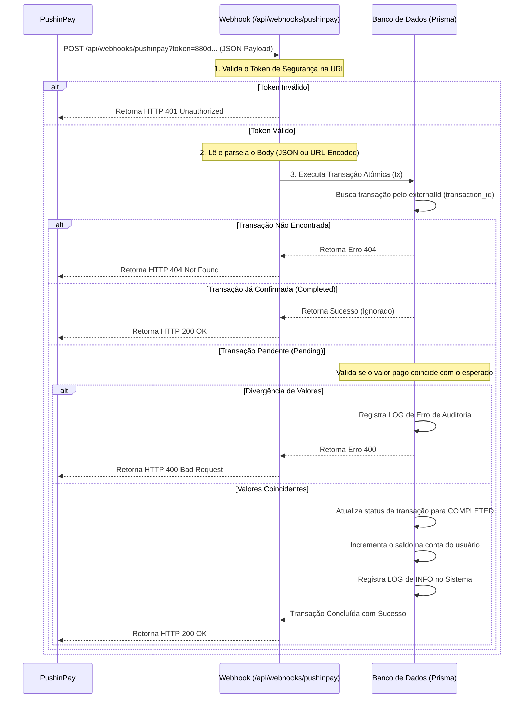

# Guia de Configuração e Funcionamento do Webhook PushinPay - Detetive Buscas

Este guia detalha como funciona a integração de pagamentos Pix em tempo real através de Webhooks na plataforma **Detetive Buscas** utilizando o gateway **PushinPay**, cobrindo o fluxo de segurança, a configuração no painel do gateway e fornecendo um script adaptado para testes.

---

## 1. Como Funciona o Webhook?
O Webhook é uma notificação do tipo HTTP POST enviada pelo servidor da PushinPay diretamente para o servidor do **Detetive Buscas** sempre que o status de uma cobrança Pix é alterado (por exemplo, quando o cliente realiza o pagamento).

No **Detetive Buscas**, o processamento foi desenhado com foco em segurança absoluta e integridade financeira:



---

## 2. Como Configurar no Painel da PushinPay

Siga os seguintes passos para colocar o Webhook para funcionar em produção:

### Passo 1: Obter a URL do Webhook da sua aplicação
O webhook do **Detetive Buscas** conta com um mecanismo de segurança de camada dupla e correspondência por ID interno:
1. **Via URL Dinâmica Gerada pelo Sistema (Padrão):** O sistema gera e envia automaticamente à PushinPay a URL contendo o token de segurança e o ID interno da transação:
   `https://detetivebuscas.com/api/webhooks/pushinpay?token=SEU_TOKEN_DO_WEBHOOK&txId=ID_INTERNO_DA_TRANSACAO`
   *Esta abordagem permite que o webhook busque o depósito prioritariamente pelo ID interno (`txId`) da URL e use o ID da PushinPay do body apenas como fallback, eliminando 100% de inconsistências ou atrasos no banco.*
2. **Via URL Limpa do Painel:** Se configurada no painel de controle da PushinPay, use:
   `https://detetivebuscas.com/api/webhooks/pushinpay`
   *Nesse modelo, a PushinPay deve enviar o token no header `x-pushinpay-token` (configurado na PushinPay no campo "Token do Webhook" com o mesmo valor de `PUSHINPAY_WEBHOOK_TOKEN` do seu `.env`).*

> [!NOTE]
> O token correspondente deve ser inserido sob a variável `PUSHINPAY_WEBHOOK_TOKEN` no arquivo `.env` de produção.

### Passo 2: Configurar no Painel da PushinPay
Como a `webhook_url` é enviada dinamicamente pelo código a cada criação de Pix, a configuração de URL no painel da PushinPay é opcional. No entanto, certifique-se de configurar o **Token do Webhook** no painel do gateway:
1. Faça login na sua conta no painel da **PushinPay**.
2. Vá até a seção de **Desenvolvedor** ou **Configurações de Webhook**.
3. No campo **Token do Webhook**, cole o exato valor que você colocou na sua variável `PUSHINPAY_WEBHOOK_TOKEN` no seu `.env` da VPS (ex: `880d03ddeda5ad631ebd021c6d7b5013`). Isso garantirá que o header `x-pushinpay-token` seja enviado de forma segura pela instituição.

### Passo 3: Configurar as Variáveis de Ambiente (.env) na VPS
No arquivo `.env` da aplicação na sua VPS, certifique-se de que as seguintes chaves estão configuradas corretamente:

```env
# Token usado para autenticar requisições de API normais (Bearer Token)
PUSHINPAY_TOKEN="67768|cy3n6j9UdLD0FeXc0ZjhiNRYrcbGL4pwBIbzJT5B0d32938d"

# Token de segurança gerado especificamente para o Webhook (Query String ?token=...)
PUSHINPAY_WEBHOOK_TOKEN="880d03ddeda5ad631ebd021c6d7b5013"
```

> [!IMPORTANT]
> Lembre-se de rodar `./update.sh` na VPS após alterar o arquivo `.env` para aplicar as novas configurações ao container do Next.js.

---

## 3. Payload do Webhook (Exemplo de Dados)
O formato do JSON enviado pela PushinPay para o webhook segue a estrutura abaixo:

```json
{
  "id": "A21A4CDF-70B5-4E06-A485-F9FA47874ADB",
  "transaction_id": "A21A4C79-A568-44A9-80CB-4EF3AFA6A777",
  "status": "paid",
  "value": "1000",
  "created_at": "2026-06-30T18:57:43.000Z"
}
```
*Note que `value` é enviado em centavos (ex: `"1000"` equivale a R$ 10,00).*

---

## 4. Script de Simulação e Teste (Node.js)
Salve o código abaixo como `test_webhook.js` para simular o disparo de uma notificação do webhook da PushinPay para a sua aplicação local ou em produção. Ele passa o token de segurança na query string (`?token=...`) conforme exigido pela segurança do Detetive Buscas.

```javascript
/**
 * Script de Teste de Webhook - Detetive Buscas
 * Como usar: node test_webhook.js <URL_BASE_WEBHOOK> <WEBHOOK_TOKEN> <TRANSACTION_ID>
 * Exemplo local: node test_webhook.js http://localhost:3000/api/webhooks/pushinpay 880d03ddeda5ad631ebd021c6d7b5013 A21A4C79-A568-44A9-80CB-4EF3AFA6A777
 */
const http = require('http');
const https = require('https');

const args = process.argv.slice(2);
const baseUrl = args[0] || 'http://localhost:3000/api/webhooks/pushinpay';
const webhookToken = args[1] || '880d03ddeda5ad631ebd021c6d7b5013';
const transactionId = args[2] || 'A21A4C79-A568-44A9-80CB-4EF3AFA6A777';

// Adiciona o token de segurança na query string (?token=...)
const targetUrl = new URL(baseUrl);
targetUrl.searchParams.set('token', webhookToken);

console.log("🚀 Iniciando simulação de Webhook da PushinPay...");
console.log(`📍 URL Alvo: ${targetUrl.toString()}`);
console.log(`🔑 Token de Segurança: ${webhookToken.substring(0, 6)}...`);
console.log(`🆔 ID da Transação: ${transactionId}\n`);

// Payload JSON simulando o pagamento concluído na PushinPay (valor em centavos, ex: 1000 = R$ 10,00)
const payload = JSON.stringify({
    transaction_id: transactionId,
    status: 'paid',
    value: '1000'
});

const client = targetUrl.protocol === 'https:' ? https : http;

const options = {
    hostname: targetUrl.hostname,
    port: targetUrl.port || (targetUrl.protocol === 'https:' ? 443 : 80),
    path: targetUrl.pathname + targetUrl.search,
    method: 'POST',
    headers: {
        'Content-Type': 'application/json',
        'Content-Length': Buffer.byteLength(payload)
    }
};

const req = client.request(options, (res) => {
    let data = '';
    console.log(`STATUS HTTP RETORNADO: ${res.statusCode}`);
    
    res.on('data', (chunk) => {
        data += chunk;
    });
    
    res.on('end', () => {
        console.log('RESPOSTA DO SERVIDOR:', data);
        if (res.statusCode === 200) {
            console.log('\n🟢 SUCESSO: Webhook aceito e processado com sucesso!');
        } else {
            console.log('\n🔴 ERRO: Verifique o console da aplicação, os logs do SystemLog e as chaves no seu .env.');
        }
    });
});

req.on('error', (e) => {
    console.error(`\n❌ Falha na conexão: ${e.message}`);
});

req.write(payload);
req.end();
```
